#Grove Indoor Environment Kit for Edison

##Hardware

Intel? Edison *1
Intel? Edison for Arduino *1
Base Shield V2 *1
Grove - Temperature&Humidity Sensor (High-Accuracy & Mini) *1
Grove - Moisture Sensor *1
Grove - Light Sensor *1
Grove - UV Sensor *1
Grove - PIR Motion Sensor *1
Grove 每 Encoder *1
Grove 每 Button *1
Grove - LCD RGB Backlight *1
Grove 每 Relay *1
Grove 每 Servo *1
Grove 每 Buzzer *1
9V to Barrel Jack Adapter *1
26AWG Grove Cable *10
USB Cable *1
##Instructions
1.Using 26AWG Grove Cable making the following connections:

Grove Modules | Connected to
-------------------- | ----------------------
Temperature&Humidity Sensor | I2C
Moisture Sensor | A1
Light Sensor | A2
UV Sensor | A3
PIR Motion Sensor | 7
Encoder | D2
Button | UART(D1)
LCD RGB Backlight | I2C
Relay | D5
Servo | D6
Buzzer | D4

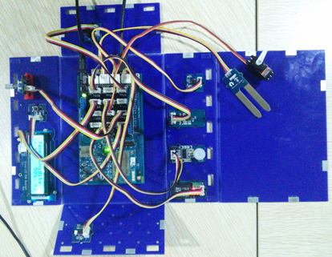

2.Set up the Development Environment, you can see the Edison Getting Started Guide.
3.Download the library and demo from github
4.Open Arduino IDE. Click Tools > Board and select Intel? Edison
5.Click Tools > Serial Port and select the Com # that the Intel Edison is connected to
6.Click Sketch>Import Library＃>Add Library and import the library downloaded at step 3
7.Click File>Examples> Grove_Indoor_Environment_Demo and select the demo
8.Click upload icon
9.Open Serial Monitor, it will print the sensors＊ information:

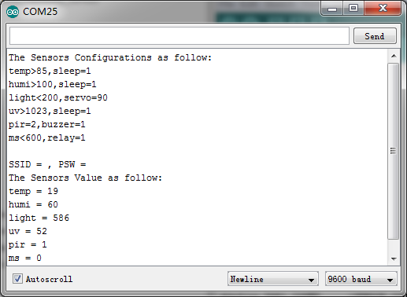

10.Rotate the Encoder to check the sensor value on the LCD.

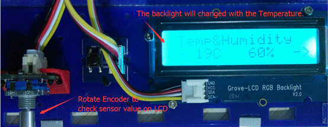

11.In the ※Send TextBox§, you can enter the following command to operate the sensors and actuators:
***Note:set [sensor][condition:>, < or =][ threshold],[actuator]=[action]

Example | Description
-------------------------- | -----------------------
set temp>40, relay=1 | if temperature is higher than 40⊥, the relay opens.
set temp>40, sleep=1 | if temperature is >40⊥, nothing to do.
set humi>60, buzzer=1 | if humidity is >60%, the buzzer beeps.
set light>600, servo=90 | if light intensity is >600, the servo truns 90∼.
set uv>80, relay=0 | if UV intensity is >80, the relay closes.
set pir=1, buzzer=1 | If people detected, the buzzer beeps.
set ms>40, relay=1 | if moisture is >40, the relay opens.
set ssid=name, psw=password | set the wifi SSID and Password.
you can open a web browser, and go to the IP address displayed on the Serial Monitor or LCD. The default port is 88. he default port is 88. 
Such as: 192.168.1.101:88

Note: 1. The command should be ended with ＆/n＊, so ※NewLine§ (in the Serial Monitor) should be selected.
     2. A actuator can only be controlled by a sensor. If A sensor wants to control a actuator(has be controlled by B sensor), B sensor should be set sleep. 

##Example: Automatic Pot-Watering

This example uses a Grove - Moisture Sensor to detect the pot soil moisture and Grove 每 Relay to control a water-pump. When the moisture is lower than the threshold, the relay will open and the pump works until the moisture is higher than the threshold.
Instructions
1.Connect the device as above, and connect the water-pump:

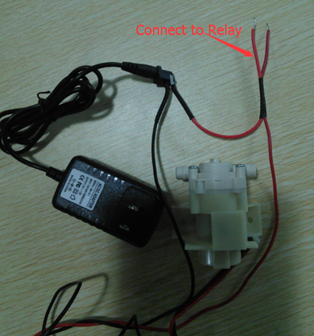

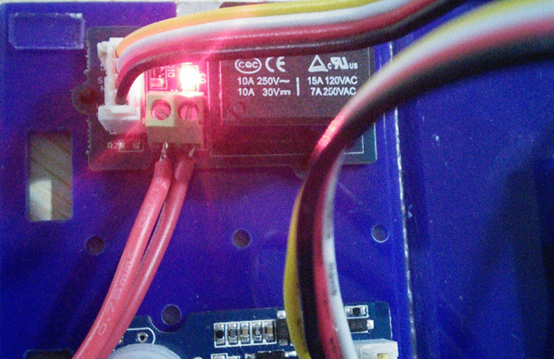

2.While Connected, open the Serial Monitor,and send the command,as follows:

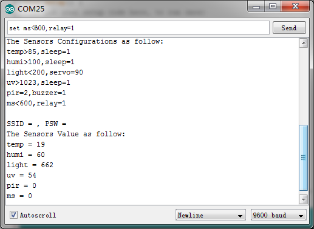

3.Insert the Grove - Moisture Sensor into your pot, check the moisture value on the LCD.

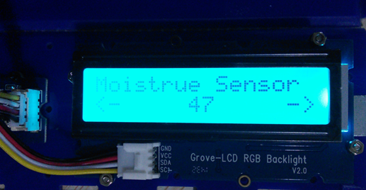

4.WiFi connection. open the Serial Monitor,and send the command,as follows. Check the local ip on the LCD or Serial Monitor. On a device connected on the same network, open a web browser, and go to the IP address above, you can see the sensor value.

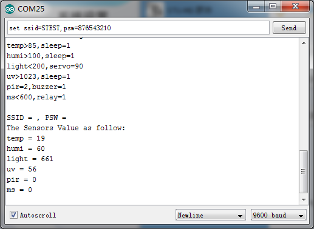

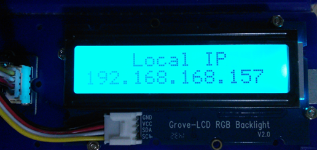

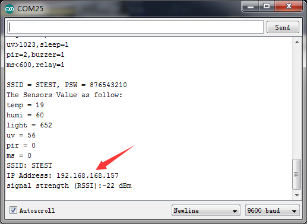

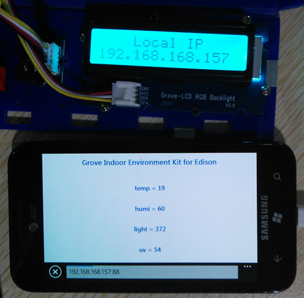

